# Perfumism

#### 한줄 소개

빅데이터를 활용하여 간단한 설문 조사 및 좋아요 기반을 통해 사용자의 취향에 맞는 향수 추천 및 향수 정보 제공 서비스.


## 기획 배경

1. 최근 코로나로 인한 마스크 착용으로 메이크업 대신 향수로 자신의 개성을 드러내며 향수의 수요가 증가
2. 향수 쇼핑몰을 많이 있지만 향수에 대해 객관적인 정보를 제공하는 국내 웹 서비스를 찾아보기 어려움


## 📅 프로젝트 기간

- 22.02.21 ~ 22.04.10


## 프로젝트 사용법

로컬 웹 서버 실행 방법

##### Frontend

```
$ cd frontend
$ npm install
# 로컬 서버 실행
$ npm start
```

##### Backend

```
$ cd backend
$ ./gradlew bootRun
```


## **🧰 사용기술**

##### Frontend

* React, Redux, TypeScript, HTML/CSS

##### Backend

* Java, Springboot, JPA

##### Server

* Nginx, AWS, Docker

##### DB

* MySQL


## 아키텍쳐


### 데이터베이스 모델링(ERD)

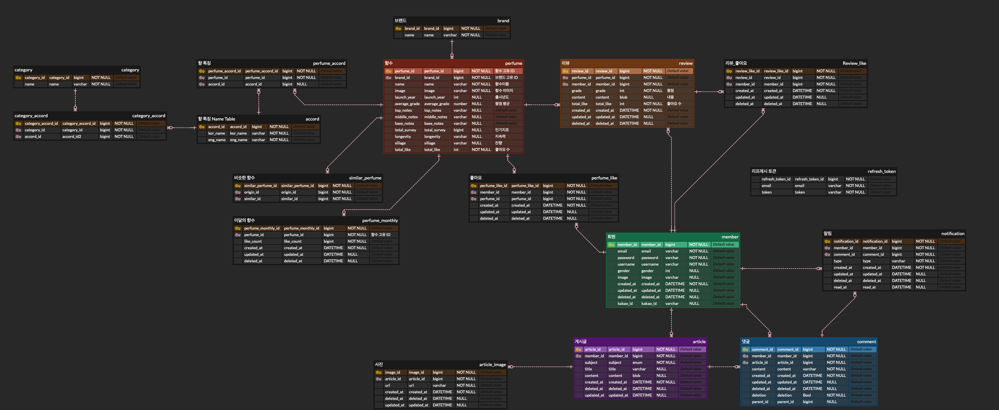

## 메인 기능

#### 1) 홈 화면

* 로그인 여부에 따라 네비게이션 바의 아이콘 변경

- (비로그인시) 사람 아이콘 클릭시 로그인 페이지로 이동
- (로그인시) 사람 아이콘 클릭시 프로필 페이지로 이동
- (로그인시) 종 모양 클릭시 알림 창이 표시 됨
- 돋보기모양 클릭시 input창이 생기고 검색이 가능
- 바로가기 클릭시 향수 추천 페이지로 이동
- 이 달의 인기 향수 표시. 향수 클릭시 해당 향수 페이지로 이동
- 최신 리뷰들 표시. 리뷰 클릭시 해당 향수 페이지로 이동

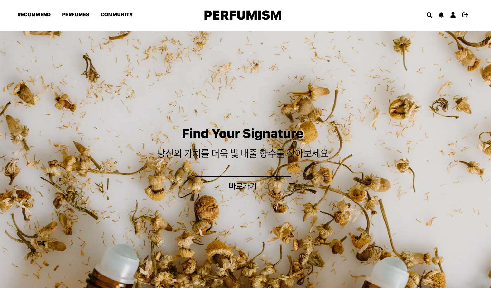

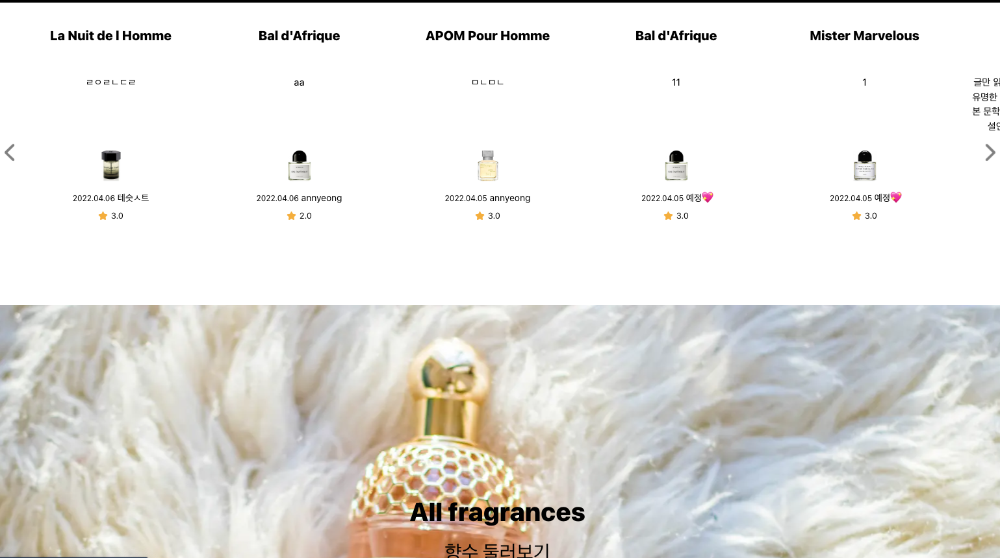

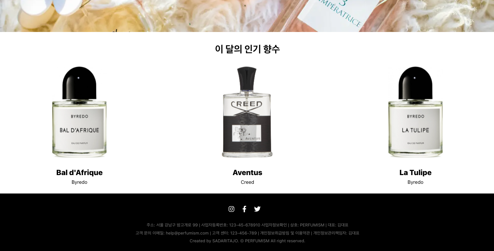

#### 2) 알림 기능

* 본인이 작성한 댓글 혹은 게시글에 댓글이 달리면 알림이 오는 기능
* 읽지 않은 알림을 숫자로 표시
* All과 Unread 버튼을 통해 모든 알림 또는 읽지 않은 알림만 조회 가능
* 읽은 알림과 읽지않은 알림 글자 색깔을 다르게 표시

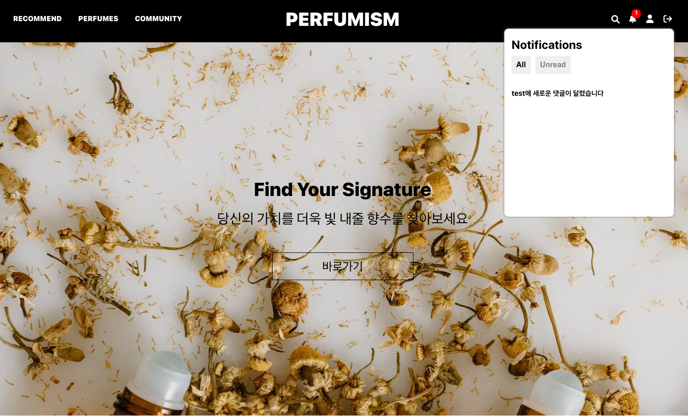

#### 3) 검색 기능

* 향수 이름, 브랜드 이름 및 어코드를 검색시 해당하는 향수 목록 표시
* 검색 결과가 없을시 결과가 없다고 표시

* enter 키를 누르지 않고 키워드를 입력만 해도 자동으로 검색

* 검색 결과 페이지에 무한 스크롤 기능 적용

  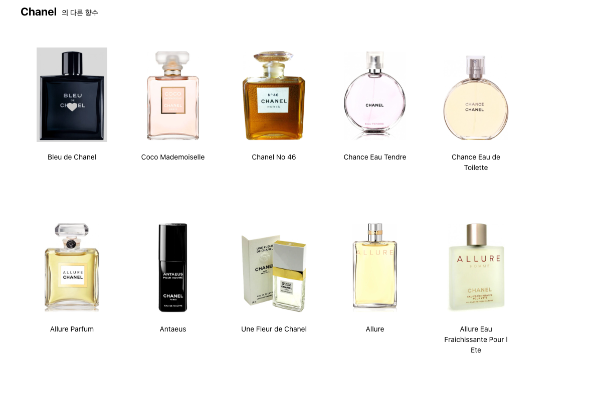

#### 검색 결과가 없을때

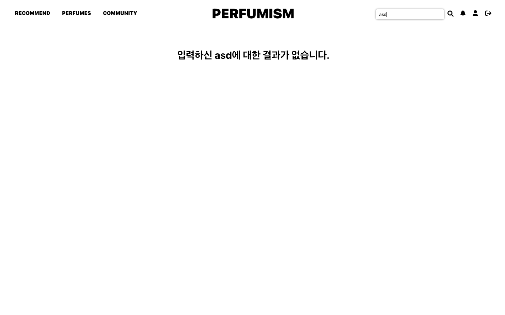

#### 4) 추천 페이지

* 설문 조사를 통한 추천, 본인이 좋아요를 누른 향수 기반의 추천 중 선택 가능
* 5가지 간단한 설문조사를 통해 해당 유저의 취향 및 향수 추천
* 결과 페이지에서 향기 취향을 워드 클라우드로 표시

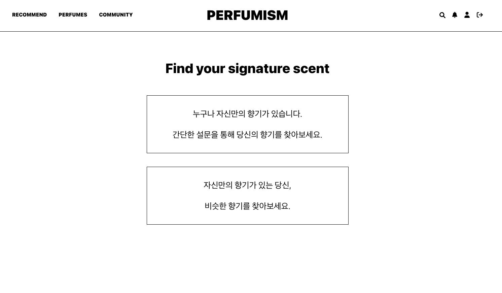

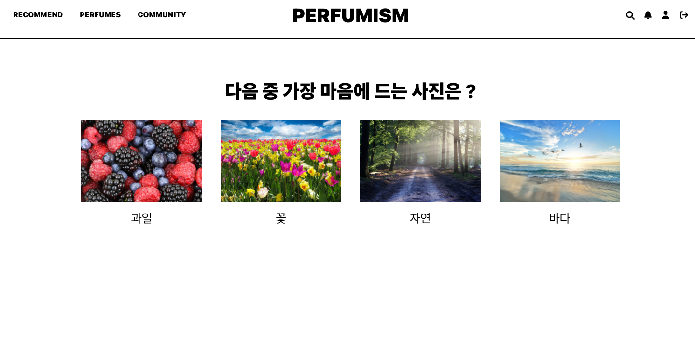

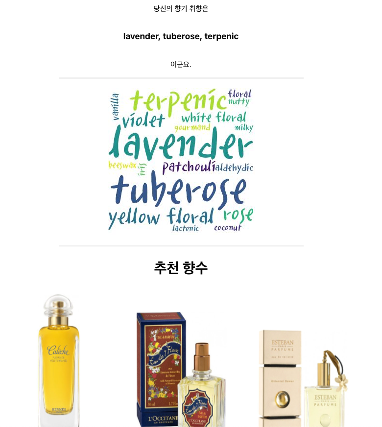

#### 5) 향수 목록

* 화면 상단의 향수 어코드 필터 기능 구현
* 오름차순, 내림차순, 트렌딩과 같은 조회 옵션 구현
* 무한 스크롤 기능 구현

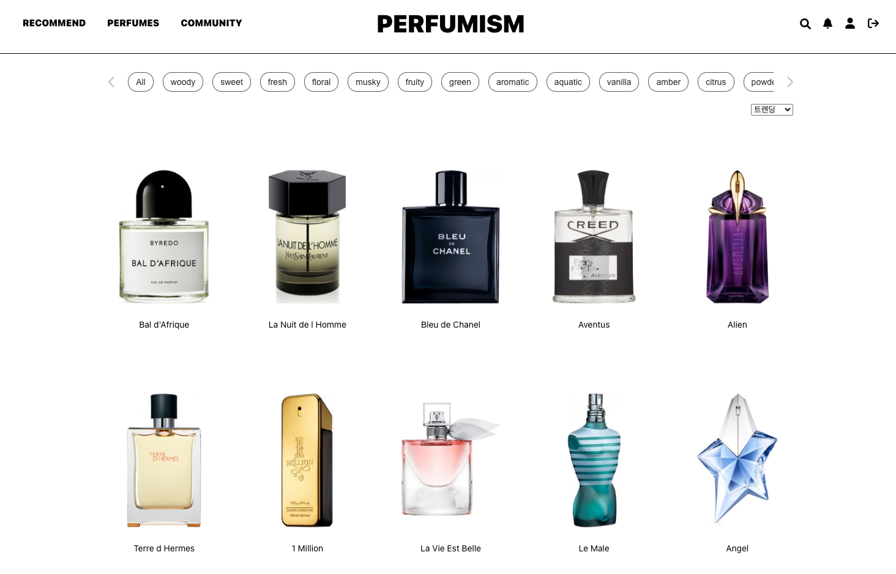

#### 6) 향수 상세 페이지

* 해당 브랜드, 메인 어코드, 향수 노트 등 향수 상세 정보 표시
* 해당 향수와 비슷한 향수들 추천 
* 동일 브랜드의 다른 향수들 추천
* 평점 및 리뷰를 작성 할 수 있는 기능 구현
* 좋아요 및 좋아요 취소 기능 구현

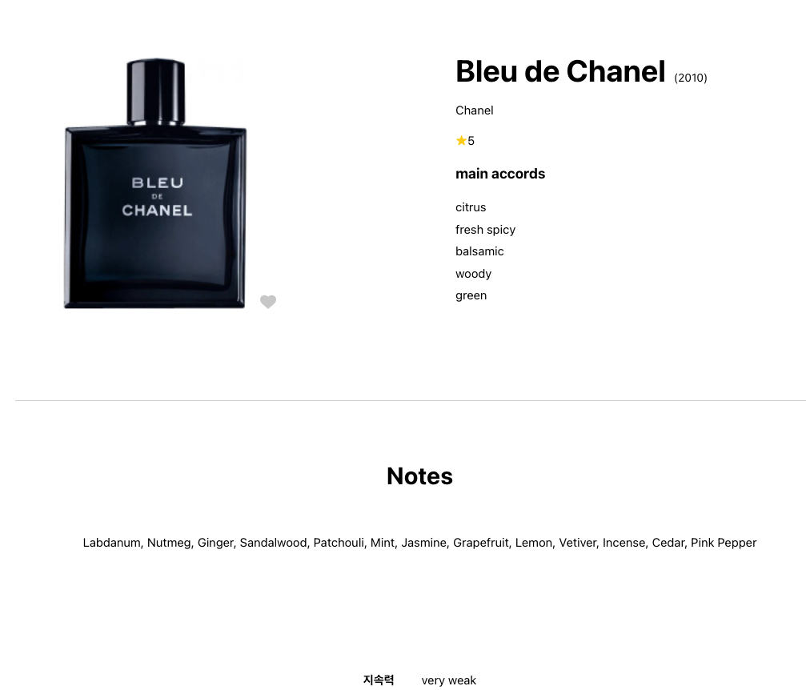

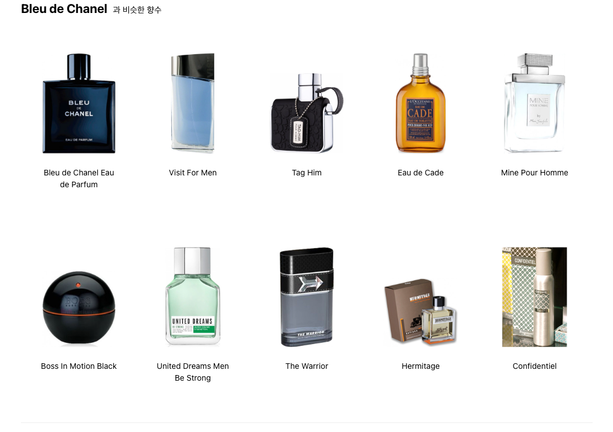

#### 7) 커뮤니티

* 말머리를 통해 해당 말머리의 글들만 조회 가능
* 글작성, 글수정 및 글 삭제 기능
* 멀티 이미지 업로드 가능
* 댓글 및 대댓글 작성 기능

#### 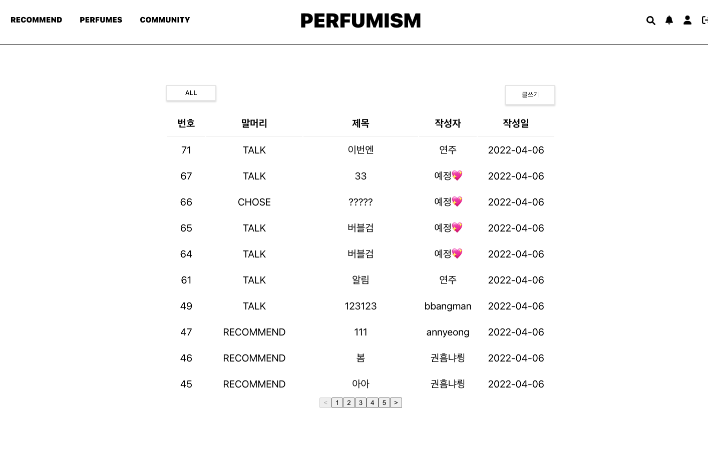

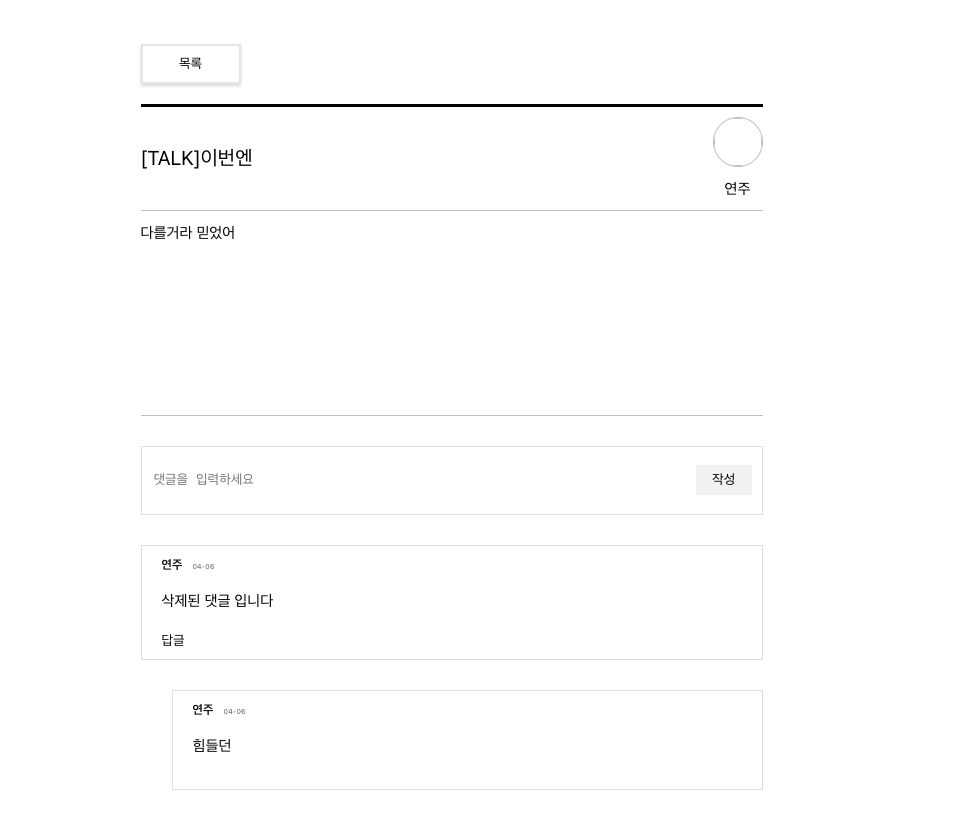


## 팀원 소개 및 소감

* **우동진(팀장 / Frontend)**

  * 구현 파트 : 메인 페이지, 로그인/회원가입 등 인증, 알림, 검색 기능, Navbar, Footer, 전체적인 반응형 CSS 구현
  
  개발 과정에서 에러를 예방하고 코드 퀄리티를 향상 시키기 위해 팀원들과 함께 타입스크립트를 공부하며 구현을 하였습니다. 아직까지 타입스크립트에 대해 모르는것이 많지만, 이렇게 사용하는구나라는 정도의 지식을 얻게된 프로젝트였습니다.
  
  또한 리액트의 장점과 클린 코드에 규칙에 기반하여 코드를 구현하고자 코드를 구현할 때 계속 생각을 하며 코드를 구현하였습니다. 
  
  기능 적으로는 처음으로 알림과 검색 기능을 구현을 하였는데, 특히 검색 기능을 구현할때 처음에는 글자를 입력할 때 마다 api요청을 보냈는데, debounce를 적용 및 이미지 압축을 통해  성능 최적화에 조금 더 신경을 쓰었고 이러한 새로운 지식들을 알게되어 재밌었습니다.
  
  그리고 이전 프로젝트에 이어 인증을 다시 맡음으로서, JWT 인증방식과 프론트단에서 어떻게 토큰 처리를 해줘야 할지에 대해서 조금더 깊게 고민을 하게 되었고 이전에는 지식과 시간의 부재로 refreshtoken과 accesstoken을 모두 다 쿠키에 저장하는짓을 해버렸는데, 이번에는 accesstoken만 기간을 짧게 한뒤 저장하고 refreshtoken의 index를 저장함으로써 보안을 좀 더 신경쓰었고, 또한 axios interceptor를 활용하여 조금 더 효율적으로 코드를 관리하였습니다. 
  
  기술적으로 한층 더 성장할 수 있었던 프로젝트였습니다.


### 기타

#### Git convention

```
$ git commit -m [#'이슈번호'] 타입 : 작업 설명 
```

* 과거시제 및 첫 시작을 대문자로 사용하지 않는다


##### 커밋메시지 타입

| git status | 의미                                      |
| ---------- | ----------------------------------------- |
| feature    | 기능 작업 시 사용                         |
| doc        | 문서 작업 시 사용                         |
| style      | 스타일 작업 시 사용                       |
| refactor   | 코드 리팩토링 시 사용                     |
| fix        | 버그 수정시 사용                          |
| chore      | 빌드 업무 수정, 패키지 매니저 수정시 사용 |
